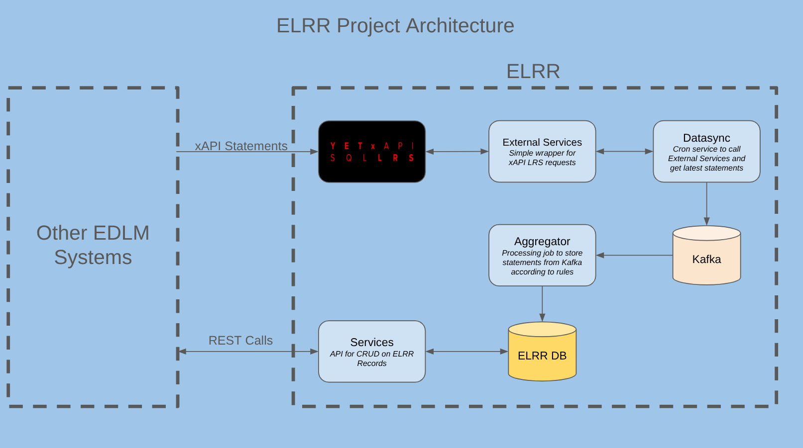

# Enterprise Learner Record Repository (ELRR) Overall Project Documentation

## ELRR Basics

### ELR (P2997) Standard

The purpose of the Enterprise Learner Record Repository is to maintain a data model and API consistent with the IEEE P2997 Enterprise Learner Record (ELR) standard. This standard is intended for communicating learner data between connected systems and across organizational boundaries in the enterprise.

The purpose of the ELR data standard is to aggregate and manage learner data generated from connected systems available within an enterprise. It is also critical that it be able to share this data via an API (the Learner API) with other systems that need it. xAPI is an effective way to transit events but can be cumbersome for querying current state. The ELR solves this problem by changing state as new events occur. For instance if you finish a course the Learner Record does not store every event and change in your progress in the course, it simply stores the result.

The source of this data is either xAPI statements collected about the individual learner or updates made directly using the Learner API. The data model defines all relevant learner records about the individual generated by multiple learning systems throughout the organization or enterprise. The ELR also references the xAPI statements, competencies (Shareable Competency Definition standard) and activities (P2881 Activity Metadata standard) relevant to the learner's experience. The ELR standard also defines, through the Learner API, how this data is shared with other systems.

The P2997 standard consists of the following classes:

| Object Name                               | Type           | Details | Notes |
|------------------------------------------|----------------|----------------|----------------|
| Person Object                            | Attributes     |                |                |
| Location Object                          | Relationships  |                |                |
| Phone Object                             | Relationships  |                |                |
| Email Object                             | Relationships  |                |                |
| Organization Object                      | Relationships  |                |                |
| Employment Record Object                 | Relationships  |                |                |
| Facility Object                          | Relationships  |                |                |
| Military Record Object                   | Relationships  |                |                |
| Medical Record Object                    | Relationships  |                |                |
| Individual Goal Object                   | Relationships  |                |                |
| Affiliation Object                       | Relationships  |                |                |
| Accreditation Object                     | Relationships  |                |                |
| Education Object                         | Relationships  |                |                |
| Team Relationships Object                | Relationships  |                |                |
| Team Manifestation Object                | Relationships  |                |                |
| Learning Resource Object                 | Relationships  |                |                |
| Learning Event Object                    | Relationships  |                |                |
| Competency Relationship Object           | Relationships  |                |                |
| Competency Assertion Record Object       | Relationships  |                |                |
| Credential Object                        | Relationships  |                |                |
| Credential Assertion Record Object       | Relationships  |                |                |

### ELRR System

This component of the TLA is primarily a mutable data store of all information related to the learner implementing the P2997 data and API standard. One essential aspect of the ELR is that it must be capable of ingesting xAPI statements of learning events and apply rules for how to update the learner record appropriately. It features a Learner API for information retrieval, and to update learner data points that may not be updated by xAPI statements alone.

The data model for the ELR is specified by the IEEE P2997 standard for Enterprise Learner Records (ELR) though there is some difference between actual relational implementation and the RDF specification. It should be noted that because the P2997 standard is in development, the ELRR implementation remains slightly behind the latest changes to the standard. This will be rectified after the standard is formally adopted.

#### ELRR Data Model

##### Diagram

See [Data Model Diagram](schema-diagram.md)

##### Schema

See [Schema](schema.md)

## Sub-Projects

ELRR was split into a number of components which each perform a specific task for the overall system. It is deployed as a set of four sub-systems at once. These are the four sub-systems:

### ELRR External Services

The External Services component of ELRR interacts with external datasources to get data for updates to ELRR Data. Currently the only implemented integration is with an LRS, so it acts as a proxy for LRS read calls.

Typically this proxy is called by Datasync which is a polling process that retrieves the data for processing by ELRR.

See [External Services Repository](https://github.com/adlnet/elrr-external-services) for sub-system specific development information.

#### Component Dependencies (must deploy first)

- LRS - External Services requires a conformant LRS from which to retrieve xAPI data.

### ELRR Datasync

The Datasync component of ELRR is a periodic process which polls data sources (at this time just the External Services proxy) to collect xAPI data and put it into a Kafka Topic for consumption and processing by ELRR.

See [Datasync Repository](https://github.com/adlnet/elrr-datasync) for sub-system specific development information.

#### Component Dependencies (must deploy first)

- External Services
- Kafka

### ELRR Aggregator

ELRR service which aggregates incoming data to perform state changes to Learner Profiles. The aggregator applies rules for learner state transformation as a result of incoming xAPI statements. These rules are updated over time to reflect business logic.

See [Aggregator Rules](rules.md)

See [Aggregator Repository](https://github.com/adlnet/elrr-aggregator) for sub-system specific development information.

#### Component Dependencies (must deploy first)

- Kafka
- Build dependency on [Service Entities Project](https://github.com/adlnet/elrr-services-entities)

### ELRR Services

This component of ELRR system houses the Learner API to allow the reading and writing of the P2997 data stored in ELRR Learner Profile.

See [Services Repository](https://github.com/adlnet/elrr-services)  for sub-system specific development information.

#### Component Dependencies (must deploy first)

- Build dependency on [Service Entities Project](https://github.com/adlnet/elrr-services-entities)

#### Endpoints

The endpoint for the ELRR Services component represent the Learner API, though progress is being made on the standard so this is subject to change. They can be found [here](service-api.md).

#### Authentication

Please see [ELRR Token Authentication](auth.md) for information on how to authenticate to the ELRR Services API.

## Integration and Flow

### xAPI Dataflow Between Systems

### Integration Points
| Source Component  | Target Component/Resource     | Default Port | Auth?                     | Notes                                              |
|-------------------|-------------------------------|-------------|----------------------------|--------------------------------------------------------|
| External Services | LRS                          | 8443        | BASIC xAPI Credentials     | Connection to get statements from LRS                   |
| Datasync          | External Services             | 8088        | N/A                        | Connection to get statements from External Services     |
| Datasync          | Postgres (Datasync DB)        | 5432        | DB Credentials             | Store sync job progress                                 |
| Datasync          | Kafka                         | 9092        | N/A                        | Push Collected Statements to Kafka Topic                |
| Aggregator        | Kafka                         | 9092        | N/A                        | Get statements from Kafka Topic                         |
| Aggregator        | Postgres (Services DB)        | 5432        | DB Credentials             | Process and update Learner Records from xAPI Statements |
| Services          | Postgres (Services DB)        | 5432        | DB Credentials             | Access and update Learner Records from Learner API      |
| *Client Systems*  | Services                      | 8092        | Admin or API Token         | Learner Records API                                     |

### Purpose of Kafka Deployment

Between the Datasync and Aggregator components sits a Kafka deployment, and it is necessary for the operation of the ELRR. Kafka is a reliable choice for durably moving data between two systems because it was designed from the ground up as a persistent, fault-tolerant log rather than a transient message queue. When xAPI data is published to a topic by Datasync, it is written to disk and replicated across multiple brokers, meaning the system can tolerate node failures without losing events. This durability is reinforced by configurable acknowledgment and replication settings, allowing Datasync to require confirmation that records have been safely stored before considering a write complete. Because Kafka retains data, the Aggregator component can recover from downtime by replaying events from the topic, ensuring that no messages are missed even if downstream systems are temporarily unavailable. 

This component facilitates decoupling from the LRS-reading side of ELRR and the service/aggregator side. Kafka provides strong guarantees around ordering and delivery that make it well-suited for system-to-system integration in this case.

## Deployment Considerations

The components, in total, require the following resources to run:

- A running LRS with statements ([SQL LRS](https://github.com/yetanalytics/lrsql) has been used and tested)
- Two Postgres databases. They need to be seeded with the appropriate schemas (see Getting Started).
- An accessible Kafka cluster with an appropriate topic

### Available Deployment Resources

A Docker Compose was created with all of the above resources to allow for easy dev deployment. It is preconfigured with all of the defaults that each component needs and can be found [here](https://github.com/adlnet/elrr-dockercompose/tree/main). The only additional step that needs to be taken is running the schema in each respective DB (either via CLI or via a DB UI such as [DBeaver](https://dbeaver.io/) or pgadmin).

Each component project linked in the components section above can be started via a cli command and each project repo details how to start it. 

## Getting Started

This quick start guide presumes you will be using the docker compose to supply all of the resources.

### Deploy Docker Compose

Clone the Docker Compose repo described above and run

`docker compose up`

### Run DB Schema Scripts

Using the credentials from the docker compose log into each database and run the schema sql for each.

- For Datasync DB the schema is `datasync/dev-resources/PostgreSQL/schema.sql` and can be found [here](https://github.com/adlnet/elrr-datasync/blob/main/dev-resources/PostgreSQL/schema.sql)
- For Services DB the schema is `services-entities/dev-resources/schema.sql` and can be found [here](https://github.com/adlnet/elrr-services-entities/blob/main/dev-resources/schema.sql)

### Confirm the LRS is deployed

Visit `localhost:8083` on host computer and use the username/password from the docker compose to log in and verify if there are statements in the LRS. If not everything will still run but the system will not do anything.

### Start the Components in Order

#### Start External Services

In external services repo, run:

- `mvn clean install`
- `mvn spring-boot:run -D spring-boot.run.profiles=local -e`  (Linux/MacOS)
or
`mvn spring-boot:run -D"spring-boot.run.profiles"=local -e` (Windows)

#### Start Datasync

In Datasync repo, run:

- `mvn clean install`
- `mvn spring-boot:run -D spring-boot.run.profiles=local -e`  (Linux/MacOS)
or
`mvn spring-boot:run -D"spring-boot.run.profiles"=local -e` (Windows)

#### Start Aggregator

In Aggregator repo, run:

`make clean build dev`

At this point you can attempt to confirm from Aggregator logs that the system is processing statements (if there are any)

#### Start Services

In Services repo, run:

`make clean build dev`

### Confirm API Access

Now that it's all deployed, using the instructions in the [Auth](auth.md) section of the docs, make queries to the Services API and confirm it is working as expected

Figma Mockups:
* [Certification / Credential Management Use-Case - Reusable Figma Design Files](https://www.figma.com/community/file/1618261630880477844)
* [Onboarding Use-Case - Reusable Figma Design Files](https://www.figma.com/community/file/1618265223330357967)
* [System Admin Use-Case - Reusable Figma Design Files](https://www.figma.com/community/file/1618279005263109055)
